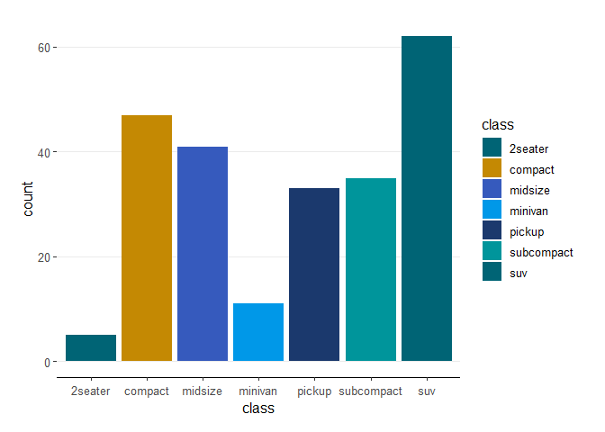
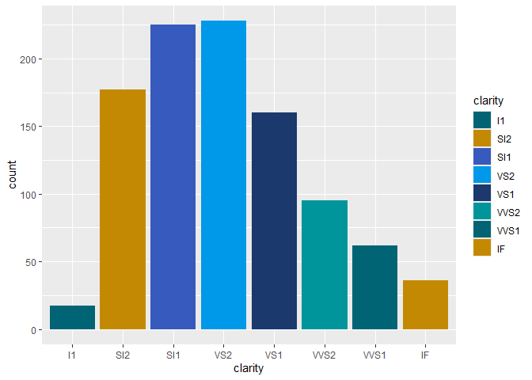
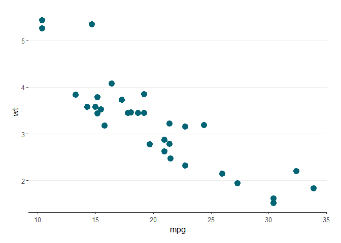
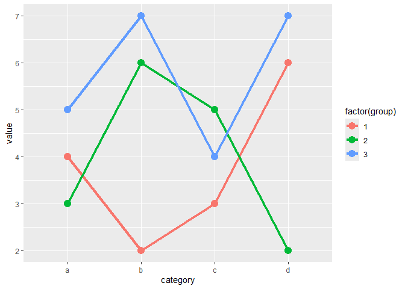
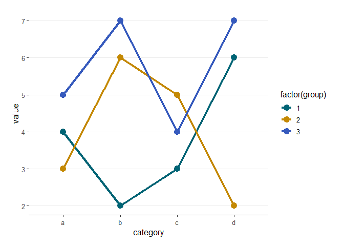
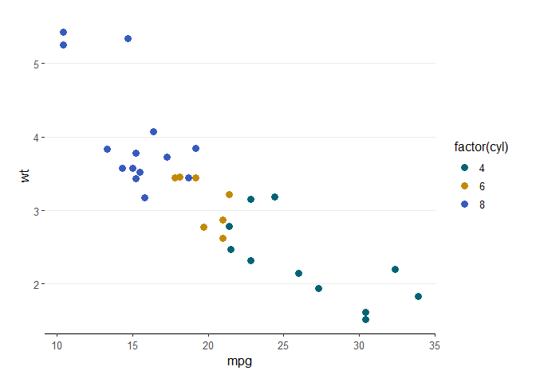

# ggcustom

`ggcustom` is an R package that provides custom themes and color scales
for `ggplot2` visualizations, including the VM color palette and theme
as one of the available style options.

## Installation

To install `ggcustom` directly from GitHub, use the `devtools` package:

``` r
# Install devtools if not already installed
install.packages("devtools")

# Install ggcustom from GitHub
devtools::install_github("jhuovari/ggcustom")
```

# Overview

The `ggcustom` package is designed to make it easy to apply consistent
themes and color schemes to ggplot2 visualizations. It includes:

- Custom color palettes for FPB and VM.
- Discrete color and fill scales using those palettes.
- FPB and VM themes for ggplot2 plots

# Usage

Once the package is installed, you can load it with:

``` r
library(ggcustom)
```
To apply all VM setting to plots just run first:

``` r
set_vm()

```

# Color Scales 

The package includes custom color scales based on the VM
color palette.

``` r
library(ggplot2)

# Example dataset
dsamp <- diamonds[sample(nrow(diamonds), 1000), ]

# Using the VM color scale
ggplot(dsamp, aes(carat, price, colour = clarity)) +
  geom_point() +
  scale_colour_vm()
```

    ## Warning in ggcustom_pal(n, "vm"): n is greater than maximum number of colors in the vm palette. Colors are recycled

<!-- -->

You can also use the fill scale for bar plots or other filled
geometries:

``` r
ggplot(dsamp, aes(clarity, fill = clarity)) +
  geom_bar() +
  scale_fill_vm()
```

    ## Warning in ggcustom_pal(n, "vm"): n is greater than maximum number of colors in the vm palette. Colors are recycled

<!-- -->

# VM Theme

The theme_vm function provides a customized ggplot2 theme based on
theme_bw, with defaults that make use of the VM color palette.

``` r
# Using the VM theme
p <- ggplot(mtcars, aes(mpg, wt)) + geom_point()
p + theme_vm()
```

<!-- -->

### Setting Custom Theme and Palette with `set_gg()`

The `set_gg()` function allows you to set a custom theme and palette for
your `ggplot2` visualizations. Below is an example using the
`theme_vm()` and the `vm` palette. For VM there is also shortcut
`set_vm()`.

``` r
# Example dataset
data <- data.frame(
  category = rep(letters[1:4], each = 3),
  value = c(4, 3, 5, 2, 6, 7, 3, 5, 4, 6, 2, 7),
  group = rep(1:3, times = 4)
)

# Define a ggplot object
p <- ggplot(data, aes(x = category, y = value, colour = factor(group), group = group)) +
  geom_line() +
  geom_point()

# Before setting custom theme and palette
p
```

<!-- -->

``` r
# Set the VM theme and VM palette
set_gg(theme_vm(), "vm")

# Plot with VM theme and VM color palette
p
```

    ## Warning: The `scale_name` argument of `discrete_scale()` is deprecated as of ggplot2 3.5.0.
    ## This warning is displayed once every 8 hours.
    ## Call `lifecycle::last_lifecycle_warnings()` to see where this warning was generated.

<!-- -->

``` r
# Optionally, reset to the original theme and scales
unset_gg()
```

    ## ggcustom unset.

``` r
# Verify that the original theme and scales are restored
p
```

<!-- -->

# Additional Palettes and Themes

The package is structured to allow additional color palettes and themes,
making it easy to expand with other organization-specific styles.

# Examples

``` r
# Scatter plot with VM theme and color scale
ggplot(mtcars, aes(mpg, wt, color = factor(cyl))) +
  geom_point(size = 3) +
  scale_colour_vm() +
  theme_vm()
```

<!-- -->

``` r
# Bar plot with VM fill scale
ggplot(mpg, aes(class, fill = class)) +
  geom_bar() +
  scale_fill_vm() +
  theme_vm()
```

    ## Warning in ggcustom_pal(n, "vm"): n is greater than maximum number of colors in the vm palette. Colors are recycled

<!-- -->

# Contributing

Contributions are welcome! If you’d like to add new color palettes,
themes, or functionality, please submit a pull request or open an issue.

# License

ggcustom is licensed under the MIT License.
